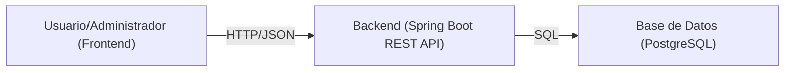
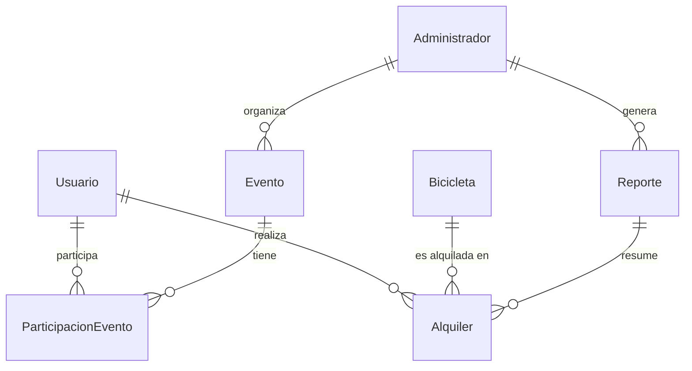
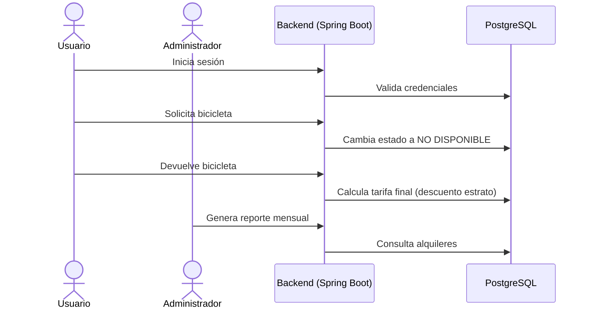

# CycloGreen
Sistema de Gestión de Alquiler de Bicicletas y Eventos de Ciclopaseo

## 1. Introducción al Proyecto
Este proyecto busca implementar un sistema de información que permita gestionar el **alquiler de bicicletas** y la **promoción de eventos de ciclopaseo** para funcionarios y aprendices del SENA.  
El sistema debe garantizar el control de disponibilidad de las bicicletas, el cálculo de tarifas con descuentos por estrato socioeconómico, y la posibilidad de organizar y participar en eventos.  

### Objetivos
- **General**: Desarrollar una solución tecnológica que facilite el uso de bicicletas y fomente la movilidad sostenible.  
- **Específicos**:
  - Controlar disponibilidad y estados de bicicletas.  
  - Gestionar alquileres, devoluciones y cálculos de tarifas.  
  - Publicar y administrar eventos de ciclopaseo.  
  - Generar reportes de uso y ganancias.  

---

## 2. Tecnologías Usadas
- **Frontend**: HTML, CSS, JavaScript  
- **Backend**: Java (Spring Boot)  
- **Base de datos**: PostgreSQL  
- **Control de versiones**: GitHub  
- **Extras**: Postman (pruebas), Figma (UI), IA (apoyo en código y documentación)  

---

## 3. Arquitectura General del Sistema
La aplicación sigue una arquitectura cliente-servidor:  
- **Frontend**: Interfaz para usuarios y administradores.  
- **Backend**: Expone servicios REST con Spring Boot.  
- **Base de datos**: PostgreSQL almacena entidades principales.  



---

## 4. Estructura de Carpetas Backend (Spring Boot)

```
src/main/java/com/sena/bicicletas/
│── entity/               # Entidades JPA (Usuario, Bicicleta, Evento, etc.)
│── repository/           # Interfaces JpaRepository (UsuarioRepository, BicicletaRepository...)
│── dto/                  # Objetos de transferencia de datos (UserDTO, AlquilerDTO...)
│── service/              # Interfaces de lógica de negocio (UserService, BikeService...)
│── service/impl/         # Implementaciones de servicios (UserServiceImpl, BikeServiceImpl...)
│── exception/            # Manejo de errores personalizados (CustomException, GlobalHandler...)
│── controller/           # Controladores REST (UserController, BikeController...)
│── config/               # Configuración (SecurityConfig, DBConfig, SwaggerConfig...)
```

### 📌 Descripción de carpetas
- **Entity**: Define las clases mapeadas a tablas de base de datos.  
- **Repository**: Interfaces que gestionan el CRUD sobre entidades.  
- **DTO**: Define objetos de transporte entre capas (evita exponer entidades directamente).  
- **Service (Interface)**: Define las reglas de negocio como contratos.  
- **Impl**: Implementaciones concretas de la lógica.  
- **Exception**: Manejo global de excepciones y validaciones.  
- **Controller**: Define los endpoints de la API REST.  
- **Config**: Configuración de seguridad, base de datos, documentación (Swagger).  

---

## 5. Modelo de Datos y Relaciones

Entidades principales:  
- Usuario  
- Administrador  
- Bicicleta  
- Alquiler  
- Evento  
- ParticipacionEvento  
- Reporte  



---

## 6. Flujo de Funcionamiento

### Flujo Usuario
1. Registro / login en el sistema.  
2. Consulta de bicicletas disponibles.  
3. Selección y alquiler de bicicleta.  
4. Cálculo de tarifa inicial.  
5. Devolución de bicicleta → cálculo final con descuento.  
6. Inscripción en eventos ciclopaseo.  

### Flujo Administrador
1. Publicación de bicicletas y eventos.  
2. Control de disponibilidad y precios.  
3. Visualización de bicicletas en uso.  
4. Generación de reportes mensuales.  



---

## 7. Módulos Funcionales

### Autenticación
- Endpoints: /auth/register, /auth/login  
- Entrada: credenciales, datos usuario  
- Salida: token JWT, datos perfil  

### Gestión de Usuarios
- CRUD de usuarios (solo admin puede eliminar).  

### Gestión de Bicicletas
- Endpoints: /bikes [GET, POST, PUT, DELETE]  
- Estado: disponible / no disponible  

### Alquiler de Bicicletas
- Endpoints: /alquileres [POST, PUT, GET]  
- Cálculo de tarifa + descuento estrato  

### Eventos de Ciclopaseo
- Endpoints: /eventos [GET, POST, PUT, DELETE]  
- Relación N:M con usuarios  

### Reportes
- Endpoint: /reportes/mensuales  
- Datos: ingresos, cantidad de alquileres  

### Geolocalización
- Muestra bicicletas en mapa interactivo (Google Maps/Leaflet).  

---

## 8. Buenas Prácticas
- GitHub con branches (`main`, `develop`, `feature/*`).  
- PRs y code reviews.  
- Postman para pruebas de endpoints.  
- Documentación con Swagger/OpenAPI.  
- Diseño UI/UX en Figma antes de implementar.  

---

## 9. Plan de Desarrollo
- **Fase 1**: Análisis y diseño (requisitos, modelo de datos, UI en Figma).  
- **Fase 2**: Desarrollo backend (entidades, repositorios, servicios, controladores).  
- **Fase 3**: Desarrollo frontend (HTML, CSS, JS con consumo de API).  
- **Fase 4**: Pruebas unitarias e integrales (Postman, JUnit).  
- **Fase 5**: Despliegue y documentación final.  

---

## Documentación

La carpeta `documentacion/` contiene recursos importantes relacionados con el proyecto, incluyendo imágenes, modelos relacionales y documentos relevantes para el desarrollo y comprensión del sistema.

// Desarrollado por: **Jhon Alexis Mendoza Rojas**.
// Metodología: **Ágil (Scrum)**.
